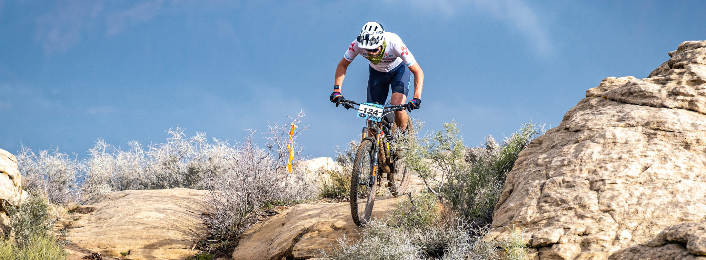
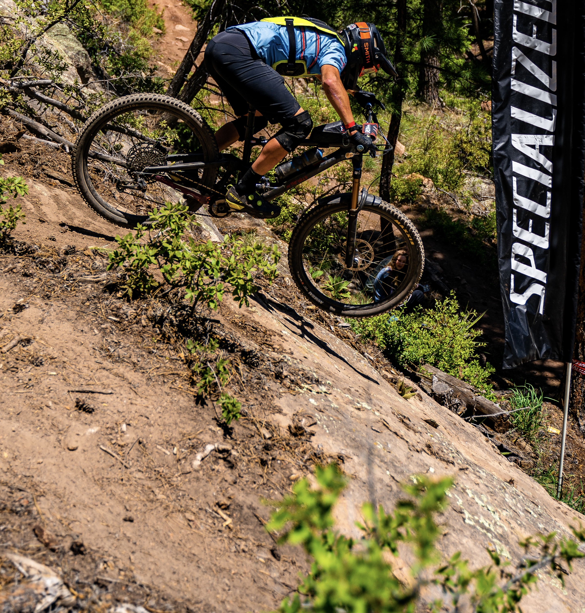

I'm an interdisciplinary off-road cyclist and racer. Interdisciplinary because every year or so I have an identity crisis about which type of racing I want to do, and off-road because I like being in the trees or on the desert rocks. I've been racing endurance events since middle school circa 2007, and gravity events since college in 2012.

_Dirt roads are still roads._

# Results
As I insist on continuing to show up to races, some of them going well is a statistical inevitability. Here are some recent examples.

|__Event__|__Result__|__Notes__|    
|-------------------------|-------------------------|-----------------------|
[24 Hours of Great Glen 2023](https://live.bullitttiming.com/event/class-group/2550/class/7112/teamResults) |1st Overall Solo|[213 miles, 26,555 feet.](https://www.strava.com/activities/9595538735) This was important enough that [I wrote about it.](https://www.instagram.com/p/CwEGKFcMuWK/)
[Revolution Enduro - Glorieta 2023](https://www.sportident.co.uk/results/RevolutionEnduro/2023/GlorietaEnduro/)  |13th/42 Open Men and 13th Overall     |Among 5 EWS professional racers.
[ABQ Grassroots Enduro 2023 -- Coyote](https://www.meetup.com/ambanm/events/292986152/)  |1st/50 Overall Men    |
[ABQ Grassroots Enduro 2023 -- Lower Sandia](https://www.meetup.com/ambanm/events/293139508)  |1st/57 Overall Men    |
[True Grit MTB 100 2023](https://my.raceresult.com/234048/)|8th Overall | 0:01 from 6th - still working on the sprinting thing.
[MBAA Enduro Hawes 2022](https://mbaaendurohawes.itsyourrace.com/ResultsMultiStage.aspx?&id=14695&y=0&st=0&cat=833&srch=)|9th Open Men| 
[El Paso Puzzler 2022](https://www.webscorer.com/racedetails?raceid=265087&did=307667)|6th Overall| 
[Reaper Madness Dual Slalom 2021](https://www.pinkbike.com/news/race-report-2021-dvo-reaper-madness-bootleg-canyon.html)|2nd Pro/Expert| 
[Eastern Collegiate Conference MTB Season 2018](https://img1.wsimg.com/blobby/go/87a1a8b1-e31c-45fe-a820-6f97a8558930/downloads/2018_mtb_overall_standings_w4b%20(2).pdf?ver=1600701277961)| 1st Overall for Omnium and Endurance | 

# Non-race activities

In recent years I've served on the trail development committee for the Albuquerque Mountain Bike Association, and stood in as acting coach for the University of Vermont MTB Nationals team for two years. In early 2021, [I raised $10,000 for the Innocence Project by riding for 24 hours in my local trail network](https://www.gofundme.com/f/24-hours-for-innocence). I also served as the MTB season coordinator for the UVM cycling team while working on my bachelors' degrees.

