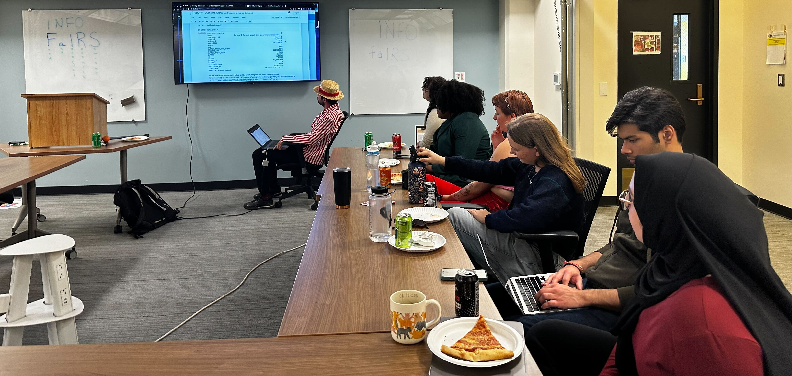
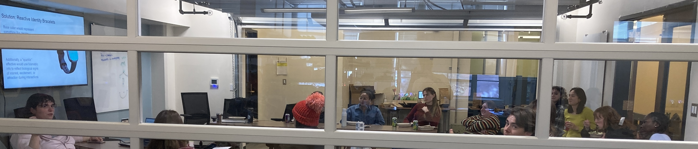

# **FaIRS** -- _Free food and Infosci Research Student seminars_.

Or something like that! A few times a semester, students in the greater INFO community can come learn about someone's research, eat free lunch, and support each other. 
<!-- I'm an interdisciplinary off-road cyclist and racer. Interdisciplinary because every year or so I have an identity crisis about which type of racing I want to do, and off-road because I like being in the trees or on the desert rocks. I've been racing endurance events since middle school circa 2007, and gravity events since college in 2012. -->

## Spring 2025 schedule

|__Presenter__|__Date__|__Notes__|    
|-------------------------|-------------------------|-----------------------|
TBD| 01-30| 

 
## Past events

|__Presenter__|__Date__|__Notes__|    
|-------------------------|-------------------------|-----------------------|
TBD| 01-30| 
 

## Testimonials

“It was kind of fun” - Elizabeth

“Did you seriously buy a costume for this?” - Laurie

“You shouldn’t have to initialize a desk.” - Matt

