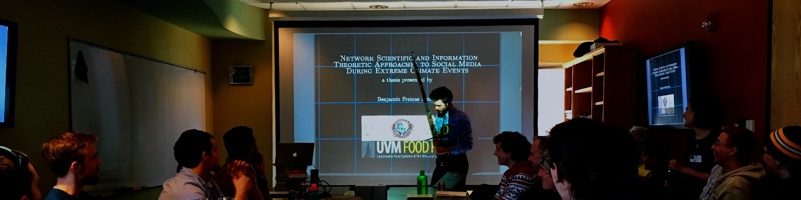

## The view from above

Over the past decade, my research projects and interests have spanned across several subject matter areas, with the common focus of system-level emergent behavior. 

Past subject of my research have included:
- climate modeling/analysis,
- power grid modeling,
- social networks,
- disaster-event communications,
- socio-cognitive modeling,
- global food systems
- sentiment analysis, information theory, and NLP.

### Background 

I completed a B.S. in Physics, B.S. in Statistics, and M.S. in Complex Systems at the University of Vermont. Following this, I spent four years as a research scientist in the Applied Information Sciences Center at Sandia National Laboratories, researching electrical grid resilience, Bayesian inversion for climate models, and agent-based models of misinformation adoption.

In 2023, I left Sandia to pursue a PhD in Information Science at the University of Colorado in Boulder, where I currently reside. At CU, I work with Professor [Brian Keegan](https://www.brianckeegan.com/), studying the online behavior of extremist groups to develop methods of predicting and preventing real-world attacks on marginalized communities.

### Publications 

1. A. Naugle, D. Krofcheck, C. Warrender, K. Lakkaraju, L. Swiler, S. Verzi, **B. F. Emery**, J. Murdock, M. Bernard, and V. Romero, “What can simulation test beds teach us about social science? results of the ground truth program,” *Computational and Mathematical Organization Theory*, pp. 1–22, 2022.
1. C. C. Nicholson, **B. F. Emery**, and M. T. Niles, “Global relationships between crop diversity and nutritional stability,” *Nature Communications*, vol. 12, no. 1, pp. 1–9, 2021.
1. **B. F. Emery**, M. T. Niles, C. M. Danforth, and P. S. Dodds, “Local information sources received the most attention from Puerto Ricans during the aftermath of Hurricane Maria,” *PLOS ONE*, vol. 16, no. 6, p. e0251704, 2021.
1. M. T. Niles, **B. F. Emery**, S. Wiltshire, M. E. Brown, B. Fisher, and T. H. Ricketts, “Climate impacts associated with reduced diet diversity in children across nineteen countries,” *Environmental Research Letters*, vol. 16, no. 1, p. 015010, 2021.
1. M. T. Niles, **B. F. Emery**, A. J. Reagan, P. S. Dodds, and C. M. Danforth, “Social media usage patterns during natural hazards,” *PLOS ONE*, vol. 14, no. 2, p. e0210484, 2019.

<!-- Benjamin Freixas Emery is a first-year PhD student in the Information Science Department at CU Boulder. His research, advised by Brian Keegan, surrounds the flow of conspiratorial misinformation, the strategies used to spread such misinformation and the prediction of action based on it. 

Before beginning his degree at CU, Ben completed bachelors’ degrees in physics and statistics as well as an MS in Complex Systems at the University of Vermont. He also spent four years as a multidisciplinary research scientist at Sandia National Labs. -->